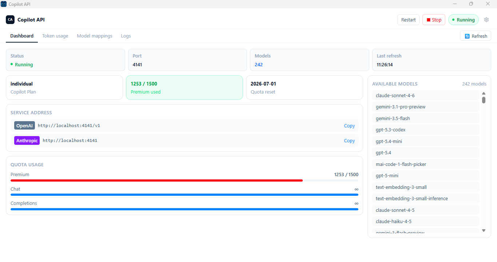
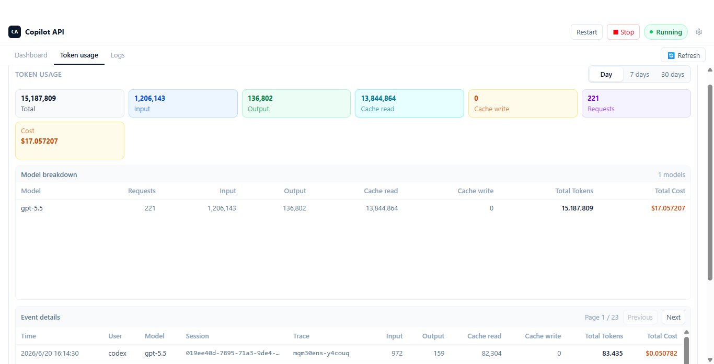
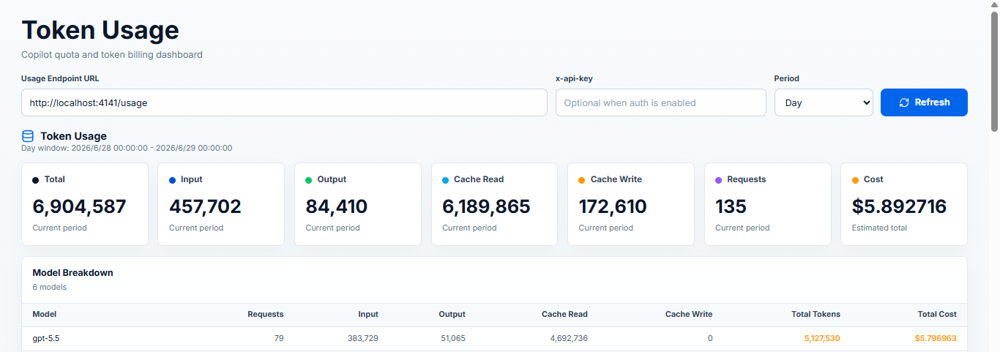

# Copilot API Proxy

English | [简体中文](./README.zh-CN.md)

## Important Notes

> [!IMPORTANT]
> **Before using, please be aware of the following:**
>
> 1. **Claude Code configuration:** When using with Claude Code, please configure the model ID as `claude-opus-4-8`. Example claude `settings.json` see [Manual Configuration with `settings.json`](#manual-configuration-with-settingsjson). 
>
> 2. **Built-in `copilot`, `codex` and third-party providers:** Run `npx @jeffreycao/copilot-api@latest auth` and choose `copilot`, `codex`, `deepseek`, `custom`, or other providers.
>
> 3. **Note:** See [GitHub Copilot Security Notice](./NOTICE.md#github-copilot-security-notice) for the warning removed from the README header.

---

## Project Overview

A small AI gateway that can use GitHub Copilot, the built-in `codex` provider, or configured third-party providers such as DashScope. GitHub Copilot is optional: if no GitHub token is available, the server can still start in provider-only mode as long as at least one enabled provider is configured.

The gateway exposes OpenAI- and Anthropic-compatible APIs from one local endpoint, so tools like [Claude Code](https://docs.anthropic.com/en/docs/claude-code/overview), OpenCode, Codex, and OpenAI-compatible clients can share the same local server.

On the GitHub Copilot path, the gateway prefers Copilot's native Anthropic-style Messages API when available, preserving more Claude-native behavior for tool-heavy workflows.

## Features

- **OpenAI and Anthropic compatibility**: Serve `/v1/responses`, `/v1/chat/completions`, `/v1/models`, `/v1/embeddings`, and `/v1/messages` from one local gateway.
- **Copilot is optional**: Use GitHub Copilot when credentials are present, or run the server with only configured providers.
- **One gateway for Copilot, `codex`, and external providers**: Route GitHub Copilot, the built-in `codex` provider, and configured third-party providers behind the same endpoint.
- **Standalone third-party providers**: Configure providers such as DashScope, DeepSeek, OpenRouter, or a custom provider and start the gateway without a GitHub Copilot login.
- **OpenAI-compatible providers on chat and Messages APIs**: `openai-compatible` providers can serve top-level `/v1/chat/completions` through `model: "provider/model"` and Anthropic-style `/v1/messages` through request/response translation.
- **Agent-friendly Claude handling on Copilot**: Prefer native `/v1/messages` when available, preserve Claude-style tool flows, support Anthropic beta features, Claude WebSearch through Responses-capable models, and keep subagent/session markers intact.
- **Claude Code and OpenCode integration**: Works with Claude Code and OpenCode, including direct Anthropic-compatible usage through `@ai-sdk/anthropic`.
- **Flexible auth and deployment options**: Supports interactive login or direct tokens, individual/business/enterprise plans, GitHub Enterprise, opencode OAuth, and custom data directories.
- **Multi-provider routing**: Expose provider-specific `/:provider/...` routes or use `model: "provider/model"` on the top-level API.

## Prerequisites

- Bun (>= 1.2.x)
- Node.js if you plan to run the published CLI with `npx`
- GitHub account with Copilot subscription only if you want to use the GitHub Copilot provider
- An API key or OAuth login for at least one configured provider if you want to run without GitHub Copilot

## Installation

To install dependencies, run:

```sh
bun install
```

To start the server directly from source:

```sh
bun run start start
```

## Running from Source

The project can be run from source in several ways:

### Development Mode

```sh
bun run dev start
```

### Production Mode

```sh
bun run start start
```

## Using with npx

You can run the project directly using npx:

> [!IMPORTANT]
> Token usage storage uses Node's built-in `node:sqlite` module when running with `npx`. It is enabled on Node.js >= 22.13.0. On Node.js < 22.13.0, the CLI still starts, but token usage storage is disabled.
>
> If you want token usage storage without upgrading Node.js, run the published CLI with Bun instead: `bunx --bun @jeffreycao/copilot-api@latest start`.

```sh
npx @jeffreycao/copilot-api@latest start
```

With options:

```sh
npx @jeffreycao/copilot-api@latest start --port 8080
```

For authentication or provider configuration only:

```sh
npx @jeffreycao/copilot-api@latest auth
```

To run without GitHub Copilot, configure at least one provider first, then start the server normally:

```sh
npx @jeffreycao/copilot-api@latest auth login --provider dashscope
npx @jeffreycao/copilot-api@latest start
```

## Using with Docker

Build the image:

```sh
docker build -t copilot-api .
```

Run the container with a bind mount so auth data survives restarts:

```sh
mkdir -p ./copilot-data
docker run -p 4141:4141 -v $(pwd)/copilot-data:/root/.local/share/copilot-api copilot-api
```

This stores GitHub auth data, provider config, and other gateway state in `./copilot-data` on the host, mapped to `/root/.local/share/copilot-api` in the container.

Or pass a GitHub token directly:

```sh
docker run -p 4141:4141 -e GH_TOKEN=your_github_token_here copilot-api
```

## Electron Desktop App

If you prefer a GUI, this repository also includes an Electron desktop app in `desktop/`. It supports GitHub Copilot sign-in, OpenAI Codex OAuth, and API-key configuration for DeepSeek, DashScope, OpenRouter, or a custom provider. After authorization or provider configuration, it can start and stop the local proxy with one click and shows the local endpoint, auth header, available models, usage, and logs in the app.

The settings screen also exposes `OAuth App`, `API Home`, `Enterprise URL`, verbose logging, and minimize-to-tray. Desktop packages are published in GitHub Releases:

https://github.com/caozhiyuan/copilot-api/releases

Download the installer for your platform, authorize or configure a provider inside the app, choose a port, start the server, then point your client at the local endpoint shown in the app. Packaged desktop builds use the bundled Electron runtime, so normal desktop usage does not require installing Node.js separately. Token usage history is enabled when that bundled runtime supports SQLite.

The desktop app's Advanced Config page reads and writes the shared model mappings through `GET/POST /admin/config/model-mappings`. The same mappings apply across `POST /v1/messages`, `POST /v1/messages/count_tokens`, `POST /v1/responses`, and `POST /v1/chat/completions` instead of being split per interface. It uses `auth.adminApiKey` instead of the regular `auth.apiKeys`, and the app reads that key directly from `config.json` after the server has generated it on startup.

### Desktop App Screenshots

Main dashboard, token usage breakdown in the bundled Electron app:

<p align="center">
  
  
</p>

## Using with Claude Code

This AI gateway can be used to power [Claude Code](https://docs.anthropic.com/en/claude-code), an experimental conversational AI assistant for developers from Anthropic.

There are two ways to configure Claude Code to use this AI gateway:

### Interactive Setup with `--claude-code` flag

To get started, run the `start` command with the `--claude-code` flag:

```sh
npx @jeffreycao/copilot-api@latest start --claude-code
```

You will be prompted to select a primary model and a "small, fast" model for background tasks. After selecting the models, a command will be copied to your clipboard. This command sets the necessary environment variables for Claude Code to use the gateway.

Paste and run this command in a new terminal to launch Claude Code.

### Manual Configuration with `settings.json`

Alternatively, you can configure Claude Code by creating a `.claude/settings.json` file in your project's root directory. This file should contain the environment variables needed by Claude Code. This way you don't need to run the interactive setup every time.

Here is an example `.claude/settings.json` file:

```json
{
  "env": {
    "ANTHROPIC_BASE_URL": "http://localhost:4141",
    "ANTHROPIC_AUTH_TOKEN": "dummy",
    "ANTHROPIC_MODEL": "deepseek/deepseek-v4-pro",
    "ANTHROPIC_DEFAULT_SONNET_MODEL": "deepseek/deepseek-v4-pro",
    "ANTHROPIC_DEFAULT_HAIKU_MODEL": "deepseek/deepseek-v4-flash",
    "DISABLE_NON_ESSENTIAL_MODEL_CALLS": "1",
    "CLAUDE_CODE_DISABLE_NONESSENTIAL_TRAFFIC": "1",
    "CLAUDE_CODE_ATTRIBUTION_HEADER": "0",
    "CLAUDE_CODE_ENABLE_PROMPT_SUGGESTION": "false",
    "CLAUDE_CODE_DISABLE_TERMINAL_TITLE": "true",
    "CLAUDE_CODE_ENABLE_AWAY_SUMMARY": "0"
  },
  "permissions": {
    "deny": [
      "mcp__ide__executeCode"
    ]
  }
}
```

- Replace `ANTHROPIC_MODEL`, `ANTHROPIC_DEFAULT_OPUS_MODEL`, `ANTHROPIC_DEFAULT_SONNET_MODEL`, and `ANTHROPIC_DEFAULT_HAIKU_MODEL` according to your needs. After configuration, please install the claude code plugin [Plugin Integrations](#plugin-integrations).  
- Setting CLAUDE_CODE_ATTRIBUTION_HEADER to 0 can prevent Claude code from adding billing and version information in system prompts, thereby avoiding prompt cache invalidation.
- Turning off CLAUDE_CODE_ENABLE_PROMPT_SUGGESTION and CLAUDE_CODE_ENABLE_AWAY_SUMMARY can prevent quota from being consumed unnecessarily.
- Claude Code WebSearch is supported for pure search requests. For Copilot, keep the global `messageApiWebSearchModel` set to a Responses-capable GPT model or a `provider/model` alias. For provider routes, use a native Anthropic provider or an `openai-responses` provider. Add `WebSearch` to `permissions.deny` only if you want to forbid this traffic.
- If using a non-Claude model, do not enable ENABLE_TOOL_SEARCH. If using the Claude model, can enable ENABLE_TOOL_SEARCH. The current Claude Code uses the client tool search mode. In this mode, loading defer tools requires an additional request each time.
- `CLAUDE_CODE_AUTO_COMPACT_WINDOW`: Set the context capacity in tokens used for auto-compaction calculations. Defaults to the model's context window: 200K for standard models or 1M for extended context models. Use a lower value like `500000` on a 1M model (e.g., `claude-opus-4-6[1m]`) to treat the window as 500K for compaction purposes. The value is capped at the model's actual context window. `CLAUDE_AUTOCOMPACT_PCT_OVERRIDE` is applied as a percentage of this value. Setting this variable decouples the compaction threshold from the status line's `used_percentage`, which always uses the model's full context window.

You can find more options here: [Claude Code settings](https://docs.anthropic.com/en/docs/claude-code/settings#environment-variables)

You can also read more about IDE integration here: [Add Claude Code to your IDE](https://docs.anthropic.com/en/docs/claude-code/ide-integrations)

## Using with OpenCode

OpenCode already has a direct GitHub Copilot provider. Use this section when you want OpenCode to point at this AI gateway through `@ai-sdk/anthropic` and reuse the agent behaviors described earlier in this README.

### Minimal setup

Start the AI gateway with the OpenCode OAuth app:

```sh
npx @jeffreycao/copilot-api@latest auth --oauth-app=opencode
npx @jeffreycao/copilot-api@latest start
```

Then point OpenCode at the gateway with `@ai-sdk/anthropic`.

Example `~/.config/opencode/opencode.json`:

```json
{
  "$schema": "https://opencode.ai/config.json",
  "provider": {
    "local": {
      "npm": "@ai-sdk/anthropic",
      "name": "My Local",
      "options": {
        "baseURL": "http://localhost:4141/v1",
        "apiKey": "dummy"
      },
      "models": {
        "gpt-5.4": {
          "name": "gpt-5.4",
          "modalities": {
            "input": ["text", "image"],
            "output": ["text"]
          },
          "limit": {
            "context": 300000,
            "output": 128000
          }
        },
        "claude-sonnet-4.6": {
          "id": "claude-sonnet-4.6",
          "name": "claude-sonnet-4.6",
          "modalities": {
            "input": ["text", "image"],
            "output": ["text"]
          },          
          "limit": {
            "context": 200000,
            "output": 32000
          },
          "options": {
            "thinking": {
              "type": "adaptive"
            },
            "effort": "max"
          }
        }
      }
    }
  }
}
```

Why these fields matter:

- `npm: "@ai-sdk/anthropic"` is the important part. OpenCode will speak Anthropic Messages semantics to this AI gateway instead of flattening everything into OpenAI Chat Completions.
- `options.baseURL` should be `http://localhost:4141/v1`; the Anthropic SDK will append `/messages`, `/models`, and `/messages/count_tokens` automatically.
- If you enable `auth.apiKeys` in this AI gateway, replace `dummy` with a real key. Otherwise any placeholder value is fine.

## Using with Codex

This AI gateway can also power Codex.

### Codex `config.toml` Reference

Add the following `[model_providers.copilot_api]` section to your Codex `~/.codex/config.toml`:

```toml
model_provider = "copilot_api"
model_reasoning_summary = "auto"
model_verbosity = "medium"
model_context_window = 272000
model_auto_compact_token_limit = 244800

[model_providers.copilot_api]
name = "OpenAI"
base_url = "http://localhost:4141"
env_key = "GITHUB_COPILOT_API_KEY"
requires_openai_auth = true
supports_websockets = false
wire_api = "responses"
request_max_retries = 3
stream_max_retries = 1
stream_idle_timeout_ms = 300000

[features]
remote_compaction_v2 = true

[analytics]
enabled = false
```

> [!NOTE]
> This configuration is specific to Codex and the GitHub Copilot provider. `name` must be set to `"OpenAI"`. It can help mitigate Codex local compact cache miss issues. If you have enabled `useResponsesApiContextManagement` (Responses API context management compaction), `remote_compaction_v2` or local compact is generally not triggered, but it may still occur when tool results return a large number of tokens.

## GPT Tool Search

For GPT Responses models such as `gpt-5.4+`, this AI gateway can expose Responses `tool_search` through a small MCP bridge. The same bridge can be used by Claude Code and opencode, as long as the client loads MCP servers and sends Anthropic Messages traffic through this gateway.

Do not set Claude Code's native `ENABLE_TOOL_SEARCH` for GPT models. That flag enables Claude Code's own client-side tool search mode, and it may stop forwarding deferred tool definitions. This gateway needs the full tool definitions so it can keep the small always-loaded tool set eager and translate every other tool into Responses deferred namespaces.

If you install `tool-search@copilot-api-marketplace`, Claude Code receives this MCP bridge automatically and you can skip the manual Claude Code MCP setup below.

Add the tool search bridge to the MCP config used by Claude Code:

```json
{
  "mcpServers": {
    "tool_search": {
      "type": "stdio",
      "command": "npx",
      "args": ["-y", "@jeffreycao/copilot-api@latest", "mcp"]
    }
  }
}
```

Add the tool search bridge to the MCP config used by opencode:

```json
{
  "mcp": {
    "tool_search": {
      "type": "local",
      "command": ["npx", "-y", "@jeffreycao/copilot-api@latest", "mcp"]
    }
  }
}
```

For local development, use `bun` as the command and `["run", "./src/main.ts", "mcp"]` as the args.

Internally, the gateway now configures OpenAI Responses `tool_search` in client-executed mode. Deferred tools are still exposed as searchable namespaces, but the model is explicitly asked to return the exact deferred tool names it wants to load next.

The bridge uses direct tool selection, not query search. Its tool input is `names`, a comma-separated list of exact deferred tool names, for example `TaskList,TaskGet,mcp__fetch__fetch`.

## Plugin Integrations

Plugin integrations are available for Claude Code and opencode.

#### Claude Code plugin integration (marketplace-based)

The Claude Code integration is packaged as two plugins:

- `agent-inject` injects `__SUBAGENT_MARKER__...` on `SubagentStart`, so the gateway can infer `x-initiator: agent`.
- `tool-search` registers the `tool_search` MCP bridge used for GPT Responses deferred tool loading.

- Marketplace catalog in this repository: `.claude-plugin/marketplace.json`
- Plugin sources in this repository: `plugin/claude/agent-inject`, `plugin/claude/tool-search`

Add the marketplace remotely:

```sh
/plugin marketplace add https://github.com/caozhiyuan/copilot-api.git
```

Install the plugins from the marketplace:

```sh
/plugin install agent-inject@copilot-api-marketplace
/plugin install tool-search@copilot-api-marketplace
```

After installation, `agent-inject` injects `__SUBAGENT_MARKER__...` on `SubagentStart`, and the gateway uses it to infer `x-initiator: agent`.

The `agent-inject` plugin also registers a `UserPromptSubmit` hook that returns `{"continue": true}`, and it can inject `SessionStart` reminder rules through environment variables:

- `CLAUDE_PLUGIN_ENABLE_QUESTION_RULES=1` enables the two reminders about using the `question` tool automatically for Claude Code. Alternatively, you can add the same reminders manually in `CLAUDE.md`; see [CLAUDE.md or AGENTS.md Recommended Content](#claudemd-or-agentsmd-recommended-content).
- `CLAUDE_PLUGIN_ENABLE_NO_BACKGROUND_AGENTS_RULE=1` enables the `run_in_background: true` avoidance reminder for agent hooks.

The `tool-search` plugin bundles the same MCP bridge described in [GPT Tool Search](#gpt-tool-search), so Claude Code users do not need to add the `tool_search` server manually when they install that plugin.

#### Opencode plugin

The subagent marker producer is packaged as an opencode plugin located at `plugin/opencode/subagent-marker.js`.

**Installation:**

Copy the plugin file to your opencode plugins directory:

```sh
# Clone or download this repository, then copy the plugin
cp plugin/opencode/subagent-marker.js ~/.config/opencode/plugins/
```

Or manually create the file at `~/.config/opencode/plugins/subagent-marker.js` with the plugin content.

**Features:**

- Tracks sub-sessions created by subagents
- Automatically prepends a marker system reminder (`__SUBAGENT_MARKER__...`) to subagent chat messages
- Sets `x-session-id` header for session tracking
- Enables the gateway to infer `x-initiator: agent` for subagent-originated requests

The plugin hooks into `session.created`, `session.deleted`, `chat.message`, and `chat.headers` events to provide seamless subagent marker functionality.

## Using the Usage Viewer

After starting the server, a URL to the Copilot Usage Dashboard will be displayed in your console. This dashboard is a web interface for monitoring your API usage.

1.  Start the server. For example, using npx:
    ```sh
    npx @jeffreycao/copilot-api@latest start
    ```
2.  The server will output a URL to the usage viewer. Copy and paste this URL into your browser. It will look something like this:
    `http://localhost:4141/usage-viewer?endpoint=http://localhost:4141/usage`
    - If you use the `start.bat` script on Windows, this page will open automatically.

The dashboard provides a user-friendly interface to view your Copilot usage data:

> Token usage history requires Bun or Node.js >= 22.13.0. On Node.js < 22.13.0, the server runs normally but token usage storage is disabled.

- **API Endpoint URL**: The dashboard is pre-configured to fetch data from your local server endpoint via a URL query parameter. You can manually switch this to any other compatible API endpoint.
- **x-api-key Authentication**: If API Key authentication is enabled, you can provide the `x-api-key` request header. The key is persisted in the browser's local storage.
- **Period Selector**: Choose from Day, Week, or Month time ranges. The URL query parameter updates automatically when you switch, making it easy to bookmark and share.
- **Fetch Data**: Click the "Refresh" button to load or refresh the usage data. The dashboard also fetches data automatically on page load.
- **Copilot Quotas**: View quota usage for services such as Chat and Completions via progress bars. Hover over a card to see used/remaining details.
- **Token Usage Metric Cards**: See a summary of Total, Input, Output, Cache Read, Cache Write, Requests, and estimated cost for the current period.
- **Trend Chart (Week / Month)**: An interactive line chart with model and metric filters. Click a data point to inspect the usage breakdown for a specific day.
- **Model Breakdown Table**: A per-model summary of requests, input/output/cache tokens, and estimated cost for the selected period.
- **Request Events (Paginated)**: A time-sorted list of request event records with pagination support, showing timestamps, models, request IDs, and token counts.
- **Detailed Information**: See the full JSON response from the API for a detailed breakdown of all available usage statistics.
- **URL-based Configuration**: You can also specify the API endpoint and period directly via `endpoint` and `period` query parameters. For example:
  `http://localhost:4141/usage-viewer?endpoint=http://your-api-server/usage&period=week`

### Usage Viewer Screenshot

<p align="center">
  
</p>

## Command Structure

Copilot API now uses a subcommand structure with these main commands:

- `start`: Start the gateway server. If a GitHub token is available, the server starts with Copilot enabled. If no GitHub token is available, it starts in provider-only mode when at least one enabled provider exists; otherwise it guides you through provider setup.
- `auth`: Run provider login or configuration without starting the server. Use it for GitHub Copilot login, Codex OAuth, or third-party provider API key setup.
- `debug`: Display diagnostic information including version, runtime details, file paths, and authentication status. Useful for troubleshooting and support.

## Command Line Options

### Global Options

The following options can be used with any subcommand. When passing them before the subcommand, use the `--key=value` form:

| Option            | Description                                            | Default | Alias |
| ----------------- | ------------------------------------------------------ | ------- | ----- |
| --api-home        | Path to the API home directory (sets COPILOT_API_HOME) | none    | none  |
| --oauth-app       | OAuth app identifier (sets COPILOT_API_OAUTH_APP)      | none    | none  |
| --enterprise-url  | Enterprise URL for GitHub (sets COPILOT_API_ENTERPRISE_URL) | none | none |

### Start Command Options

The following command line options are available for the `start` command:

| Option         | Description                                                                   | Default    | Alias |
| -------------- | ----------------------------------------------------------------------------- | ---------- | ----- |
| --port         | Port to listen on                                                             | 4141       | -p    |
| --verbose      | Enable verbose logging                                                        | false      | -v    |
| --github-token | Provide GitHub token directly (must be generated using the `auth` subcommand) | none       | -g    |
| --claude-code  | Generate a command to launch Claude Code with Copilot API config              | false      | -c    |
| --show-token   | Show GitHub and Copilot tokens on fetch and refresh                           | false      | none  |
| --proxy-env    | Initialize proxy from environment variables                                   | false      | none  |

### Auth Command Options

| Option       | Description               | Default | Alias |
| ------------ | ------------------------- | ------- | ----- |
| --provider   | Provider to log in with or configure (`copilot`, `codex`, `opencode-go`, `deepseek`, `dashscope`, `openrouter`, or `custom`) | prompt | none |
| --verbose    | Enable verbose logging    | false   | -v    |
| --show-token | Show GitHub token on auth | false   | none  |

Use `copilot-api auth login --provider copilot` only when you want to enable the GitHub Copilot provider. Copilot is not required for `codex` or third-party provider-only usage.

Use `copilot-api auth login --provider deepseek`, `--provider dashscope`, `--provider openrouter`, or `--provider opencode-go` to add or update those common third-party providers from the CLI. DeepSeek prompts for masked `apiKey`, provider `type` (default `anthropic`), and `baseUrl` defaulting to `https://api.deepseek.com/anthropic`. DashScope prompts for masked `apiKey`, provider `type` (default `openai-compatible`), and prefilled `baseUrl`. OpenRouter prompts for masked `apiKey` and prefilled `baseUrl` only, and writes `type: "anthropic"`. OpenCode Go prompts for masked `apiKey` and prefilled `baseUrl` only, and writes `type: "openai-compatible"` (baseUrl `https://opencode.ai/zen/go`). After a provider is configured and enabled, `copilot-api start` can run without any GitHub token.

Use `copilot-api auth login --provider custom` to add or update another third-party provider from the CLI. The command prompts for the provider name, supported type (`anthropic`, `openai-compatible`, or `openai-responses`), `baseUrl`, masked `apiKey`, and `authType`; `authType` may be left as the type default or set to `x-api-key` / `authorization`.

### Debug Command Options

| Option | Description               | Default | Alias |
| ------ | ------------------------- | ------- | ----- |
| --json | Output debug info as JSON | false   | none  |

## Configuration (config.json)

- **Location:** `~/.local/share/copilot-api/config.json` (Linux/macOS) or `%USERPROFILE%\.local\share\copilot-api\config.json` (Windows).
- **Default shape:**
  ```json
  {
    "auth": {
      "apiKeys": [],
      "adminApiKey": "<auto-generated-on-startup>"
    },
    "providers": {},
    "modelMappings": {},
    "extraPrompts": {
      "gpt-5-mini": "<built-in exploration prompt>"
    },
    "smallModel": "gpt-5-mini",
    "useResponsesApiContextManagement": true,
    "modelResponsesApiCompactThresholds": {
      "gpt-5.4": 217600,
      "gpt-5.5": 217600
    },
    "modelReasoningEfforts": {
      "gpt-5-mini": "low"
    },
    "useMessagesApi": true,
    "useResponsesApiWebSocket": true,
    "useResponsesApiWebSearch": true,
    "messageApiWebSearchModel": "gpt-5-mini",
    "parityFirst": true
  }
  ```
- **auth.apiKeys:** API keys used for request authentication on non-admin routes. Supports multiple keys for rotation. Requests can authenticate with either `x-api-key: <key>` or `Authorization: Bearer <key>`. If empty or omitted, authentication for non-admin routes is disabled.
- **auth.adminApiKey:** Single admin key used only for `/admin/*` routes. If missing, the server generates a random key at startup and writes it back to `config.json`. Requests use the same `x-api-key` or `Authorization: Bearer` headers, but regular `auth.apiKeys` never grant access to `/admin/*`.
- **modelMappings:** Exact `sourceModel -> targetModel` rewrites shared by top-level `POST /v1/messages`, `POST /v1/messages/count_tokens`, `POST /v1/responses`, and `POST /v1/chat/completions` requests. Omit it or leave it as `{}` to disable rewrites. Both the source and target must be non-empty strings. Targets can be regular model IDs or `provider/model` aliases such as `dashscope/qwen3.6-plus`, and the rewrite happens before provider alias parsing. These mappings are not split per interface. The admin endpoints `GET/POST /admin/config/model-mappings` read and update only this field.
- **extraPrompts:** Map of `model -> prompt` appended to the first system prompt when translating Anthropic-style requests to Responses API. Use this to inject guardrails or guidance per model. Missing default entries are auto-added without overwriting your custom prompts. For GPT-5.3+ models (e.g. `gpt-5.3-codex`, `gpt-5.4`, `gpt-5.5`), a built-in commentary prompt is used as fallback when not explicitly configured. The built-in prompts enable phase-aware commentary, which lets the model emit a short user-facing progress update before tools or deeper reasoning.
- **providers:** Global upstream provider map. Each provider key (for example `dashscope`) becomes a route prefix (`/dashscope/v1/messages`). Supports `type: "anthropic"`, `type: "openai-compatible"`, and `type: "openai-responses"`. Top-level clients can also use `model: "dashscope/model-id"` with `/v1/messages`, `/v1/messages/count_tokens`, `/v1/responses`, and `/v1/chat/completions`; the gateway strips the `dashscope/` prefix before forwarding upstream. `openai-compatible` providers support both chat and Messages flows: `/v1/chat/completions` is proxied to upstream `/v1/chat/completions`, while `/v1/messages` and `/:provider/v1/messages` are translated to upstream chat completions and translated back to Anthropic Messages responses. `GET /v1/models` aggregates enabled provider models with `provider/model-id` IDs; use `GET /dashscope/v1/models` for a single provider's raw model list.
  - `enabled` defaults to `true` if omitted.
  - `baseUrl` should be provider API base URL without the final endpoint. For Anthropic providers, omit `/v1/messages`; for OpenAI-compatible providers, omit `/v1/chat/completions`; for OpenAI Responses providers, omit `/v1/responses`.
  - `apiKey` is used as the upstream credential value and is required for regular providers.
  - `authType` (optional): Controls how `apiKey` is sent upstream. Supports `x-api-key` and `authorization` for regular providers. Anthropic providers default to `x-api-key`; OpenAI-compatible and OpenAI Responses providers default to `authorization`. When set to `authorization`, the proxy sends `Authorization: Bearer <apiKey>`. `oauth2` is reserved for the built-in `codex` provider and is written automatically by `auth login --provider codex`.
  - `pricingCurrency` (optional): Provider-level currency used for token cost calculation, for example `USD` or `CNY`. Quick providers default to `CNY` for DashScope and DeepSeek, and `USD` for Codex/OpenRouter. Costs are grouped by currency and are not exchange-rate converted.
  - `models` (optional): Per-model configuration map. Each key is a model ID (matching the model name in requests), and the value is:
    - `temperature` (optional): Default temperature value used when the request does not specify one.
    - `topP` (optional): Default top_p value used when the request does not specify one.
    - `topK` (optional): Default top_k value used when the request does not specify one.
    - `extraBody` (optional): Dynamic fields merged into the upstream request body for that model. Request body fields with the same name take precedence. OpenAI-compatible providers can use this for fields such as `enable_thinking`, `preserve_thinking`, `reasoning_effort`. `thinking_budget` is a special OpenAI-compatible provider override: when configured in `extraBody`, it is forced after Anthropic `thinking.budget_tokens` translation and overrides the request-derived budget. For providers whose name is `dashscope` or whose `baseUrl` contains `aliyuncs.com`, the request-derived `thinking_budget` (from Anthropic `thinking.budget_tokens`) is forwarded upstream; for other OpenAI-compatible providers the request-derived `thinking_budget` is stripped, while an `extraBody` `thinking_budget` is still honored. For DashScope providers, `preserve_thinking` defaults to `true` when not explicitly set in `extraBody` or the request body.
    - `pricing` (optional): Per-model token prices, in the provider `pricingCurrency`, per 1M tokens. Supported fields are `input`, `output`, `cachedInput` (implicit cache read), `explicitCachedInput` (explicit cache read), and `cacheCreationInput`. Use `tiers` with `maxInputTokens` for input-size tiered pricing.
    - `contextCache` (optional): Defaults to `true` for providers whose name is `dashscope` or whose `baseUrl` contains `aliyuncs.com`; defaults to `false` for other OpenAI-compatible providers. This enables Alibaba Cloud Model Studio/DashScope explicit context cache by injecting `cache_control: { "type": "ephemeral" }` on up to 4 content blocks using the Context Cache format. The cache breakpoint strategy matches opencode's main provider flow: the first 2 system messages plus the last 2 non-system messages. Marked string content is converted to text content part arrays for `system` / `user` / `assistant` / `tool` messages; existing array content is marked on the last part. Set this to `false` when the model already supports implicit caching, or when the upstream does not accept this explicit-cache extension field. Set this to `true` for non-DashScope providers that support the same explicit-cache extension. Applied on both `/v1/messages` and `/v1/chat/completions` routes.
    - `supportPdf` (optional): Controls whether the model supports PDF/document content. Defaults to `false`; unsupported PDFs are converted to a text notice. Set it to `true` to send PDF/document blocks as OpenAI Chat Completions file parts.
    - `toolContentSupportType` (optional): Tool result content capabilities for that model, as an array of `array`, `image`, and `pdf`. Provider routes default to string-only tool content when omitted. If `supportPdf` is `true` but this list does not include `pdf`, file parts in tool results are moved to user role messages. This provider default does not change the Copilot main flow, which continues to support array + image and not PDF.
    - `type` (optional): Per-model override of the provider protocol type. Supports `anthropic`, `openai-compatible`, and `openai-responses`. When set, the provider's `/v1/messages` route uses this model's type instead of the provider-level type for request routing, auth header resolution, and upstream endpoint selection. This is useful for providers like OpenCode Go whose upstream supports both OpenAI-compatible and Anthropic Messages APIs for different models. When the type is overridden, the auth header is resolved from the overridden type's default (Anthropic defaults to `x-api-key`; OpenAI-compatible/Responses default to `authorization`).

  Example DashScope model settings:
  ```json
  {
    "providers": {
      "dashscope": {
        "type": "openai-compatible",
        "enabled": true,
        "baseUrl": "https://dashscope.aliyuncs.com/compatible-mode",
        "apiKey": "sk-your-dashscope-key",
        "pricingCurrency": "CNY",
        "models": {
          "qwen3.7-plus": {
            "temperature": 1,
            "topP": 0.95,
            "topK": 20,
            "extraBody": {
              "preserve_thinking": true
            }
          },
          "glm-5.1": {
            "temperature": 0.7,
            "topP": 0.95,
            "contextCache": true,
            "pricing": {
              "tiers": [
                {
                  "maxInputTokens": 32000,
                  "input": 6,
                  "cachedInput": 1.2,
                  "explicitCachedInput": 0.6,
                  "cacheCreationInput": 7.5,
                  "output": 24
                },
                {
                  "maxInputTokens": 200000,
                  "input": 8,
                  "cachedInput": 1.6,
                  "explicitCachedInput": 0.8,
                  "cacheCreationInput": 10,
                  "output": 28
                }
              ]
            },
            "extraBody": {
              "preserve_thinking": true
            }
          }
        }
      }
    }
  }
  ```
  Built-in token prices cover Codex GPT models in USD, DashScope `qwen3.7-max`, `qwen3.7-plus`, `glm-5.1`, `glm-5.2` in CNY, DeepSeek `deepseek-v4-flash`, `deepseek-v4-pro`, `deepseek-chat`, `deepseek-reasoner` in CNY, and OpenCode Go models (`glm-5.2`, `deepseek-v4-flash`, `deepseek-v4-pro`, `kimi-k2.7-code`, `mimo-v2.5`, `mimo-v2.5-pro`, `qwen3.7-plus`, `qwen3.7-max`, `minimax-m2.5`, `minimax-m3`) in USD. User `pricing` entries override built-ins. For DashScope, cached tokens are charged as explicit cache reads when the upstream usage includes `cache_creation_input_tokens`; otherwise `cachedInput` is used as the implicit cache read price. For DeepSeek, `prompt_cache_hit_tokens` map to cached input and `prompt_cache_miss_tokens` map to regular input.
- **smallModel:** Fallback model used for tool-less warmup messages (e.g., Claude Code probe requests) only when `parityFirst` is `false`; defaults to `gpt-5-mini`.
- **parityFirst:** When `true` (default), the proxy avoids request-saving rewrites: warmup/no-tools requests keep their requested model instead of falling back to `smallModel`, and `tool_result` boundaries are preserved. Explicit `modelMappings`, provider aliases, endpoint model normalization, and schema-compatibility fixes still apply. Set to `false` to restore the legacy warmup-to-`smallModel` override and `tool_result` content merging behavior.
- **useResponsesApiContextManagement:** When `true`, the proxy adds Responses API `context_management` compaction instructions. Defaults to `true`. Set it to `false` to disable this globally. When enabled, the request includes `context_management` in the body and keeps only the latest compaction carrier on follow-up turns. This is especially useful for long-running tasks.
- **modelResponsesApiCompactThresholds:** Per-model Responses API `compact_threshold` overrides used when the proxy adds `context_management`. These values take precedence over the fallback threshold from `resolveResponsesCompactThreshold` (`max_prompt_tokens * ratio`, or the default fallback). Defaults set `gpt-5.4` and `gpt-5.5` to `217600` (`272000 * 0.8`). Models not listed continue to use the normal fallback logic.
- **modelReasoningEfforts:** Per-model reasoning effort applied to `/v1/messages` requests. When routed to the Copilot native Messages API it sets `output_config.effort`; when translated to the Responses API it sets `reasoning.effort`. Allowed values are `none`, `minimal`, `low`, `medium`, `high`, `xhigh`, and `max`. If a model isn't listed, `high` is used by default; GPT-5.3+ models fall back to `xhigh` when not explicitly configured.
- **useMessagesApi:** When `true`, Claude-family models that support Copilot's native `/v1/messages` endpoint will use the Messages API; otherwise they fall back to `/chat/completions`. Set to `false` to disable Messages API routing and always use `/chat/completions`. Defaults to `true`.
- **useResponsesApiWebSocket:** When `true`, Responses API requests use Copilot's websocket transport for models that advertise `ws:/responses`; models that only advertise `/responses` continue to use HTTP. Set to `false` to disable websocket routing and use HTTP `/responses` whenever the selected model supports it. Defaults to `true`.
- **useResponsesApiWebSearch:** When `true`, the server keeps Responses API tools with `type: "web_search"` and forwards them upstream. Set to `false` to strip those tools from `/responses` payloads. Defaults to `true`.
- **messageApiWebSearchModel:** Global model used when a top-level Copilot `/v1/messages` request contains only the server-side `web_search` tool. Defaults to `gpt-5-mini`. If the value is a `provider/model` alias, the request is routed into that provider's Messages API path with the provider prefix stripped. For Copilot GPT models, web search runs through `/responses`. Mixed `web_search` plus custom tools are not supported and the server-side `web_search` tool is stripped.
- **claudeTokenMultiplier:** Multiplier applied to the fallback GPT-tokenizer estimate for Claude `/v1/messages/count_tokens` requests. Defaults to `1.15`. Increase it if your client is still compacting too late. This setting is only used when the proxy is estimating Claude tokens locally; if `anthropicApiKey` is configured and Anthropic token counting succeeds, the exact Anthropic count is returned instead.
- **anthropicApiKey:** Anthropic API key used to forward Claude `/v1/messages/count_tokens` requests to Anthropic's real token counting endpoint, which returns exact counts instead of GPT tokenizer estimates. Can also be set via the `ANTHROPIC_API_KEY` environment variable. If not set, or if the upstream call fails, token counting falls back to local GPT tokenizer estimation controlled by `claudeTokenMultiplier`.

Edit this file to customize prompts or swap in your own fast model. Restart the server (or rerun the command) after changes so the cached config is refreshed.

## API Authentication

- **Protected non-admin routes:** All routes except `/`, `/usage-viewer`, and `/usage-viewer/` require authentication when `auth.apiKeys` is configured and non-empty.
- **Admin routes:** All `/admin/*` routes require `auth.adminApiKey`. If it is missing, the server generates one at startup and persists it to `config.json` before serving requests.
- **Allowed auth headers:**
  - `x-api-key: <your_key>`
  - `Authorization: Bearer <your_key>`
- **CORS preflight:** `OPTIONS` requests are always allowed.
- **When no regular keys are configured:** Non-admin routes continue to allow requests. This does not apply to `/admin/*`, which only accepts `auth.adminApiKey`.

Example request for a regular protected route:

```sh
curl http://localhost:4141/v1/models \
  -H "x-api-key: your_api_key"
```

Example request for an admin route:

```sh
curl http://localhost:4141/admin/config/model-mappings \
  -H "x-api-key: your_admin_api_key"
```

## API Endpoints

The server exposes several OpenAI- and Anthropic-compatible endpoints. Requests can target GitHub Copilot, the built-in `codex` provider, or configured providers depending on the selected model and `provider/model` alias.

### OpenAI Compatible Endpoints

These endpoints mimic the OpenAI API structure.

| Endpoint                    | Method | Description                                                      |
| --------------------------- | ------ | ---------------------------------------------------------------- |
| `POST /v1/responses`        | `POST` | OpenAI Most advanced interface for generating model responses. Supports `provider/model` aliases for `openai-responses` providers. |
| `POST /v1/chat/completions` | `POST` | Creates a model response for the given chat conversation. Supports `provider/model` aliases for `openai-compatible` providers and can be used without Copilot when the target provider is configured. |
| `GET /v1/models`            | `GET`  | Lists Copilot models plus enabled provider models using `provider/model-id` IDs. |
| `POST /v1/embeddings`       | `POST` | Creates an embedding vector representing the input text.         |

### Anthropic Compatible Endpoints

These endpoints are designed to be compatible with the Anthropic Messages API.

| Endpoint                         | Method | Description                                                  |
| -------------------------------- | ------ | ------------------------------------------------------------ |
| `POST /v1/messages`              | `POST` | Creates a model response for a given conversation. Supports `provider/model` aliases for configured providers, including translation through `openai-compatible` providers. |
| `POST /v1/messages/count_tokens` | `POST` | Calculates the number of tokens for a given set of messages. Supports `provider/model` aliases for configured providers. |
| `POST /:provider/v1/messages`       | `POST` | Proxies Anthropic Messages requests to the configured Anthropic provider, translates them through an OpenAI-compatible provider, or translates them through an OpenAI Responses provider. |
| `GET /:provider/v1/models`          | `GET`  | Proxies model listing requests to the configured provider.   |
| `POST /:provider/v1/messages/count_tokens` | `POST` | Calculates tokens locally for provider route requests. |

### Usage Monitoring Endpoints

New endpoints for monitoring your Copilot usage and quotas.

| Endpoint     | Method | Description                                                  |
| ------------ | ------ | ------------------------------------------------------------ |
| `GET /usage` | `GET`  | Get detailed Copilot usage statistics and quota information. |
| `GET /token` | `GET`  | Get the current Copilot token being used by the API.         |

### Admin / Configuration Endpoints

These endpoints are reserved for local administrative actions and only accept `auth.adminApiKey`.

| Endpoint                              | Method | Description                                                                 |
| ------------------------------------- | ------ | --------------------------------------------------------------------------- |
| `GET /admin/config/model-mappings`    | `GET`  | Returns the current `config.json` path and the active `modelMappings` map.  |
| `POST /admin/config/model-mappings`   | `POST` | Updates only the `modelMappings` field in `config.json` and returns it back. |

## Example Usage

Common `npx` commands:

```sh
# Start the gateway
npx @jeffreycao/copilot-api@latest start

# Start on a custom port with verbose logging
npx @jeffreycao/copilot-api@latest start --port 8080 --verbose

# Run the auth flow
npx @jeffreycao/copilot-api@latest auth login

# Configure a third-party provider, then run without GitHub Copilot
npx @jeffreycao/copilot-api@latest auth login --provider dashscope
npx @jeffreycao/copilot-api@latest start

# Print debug information as JSON
npx @jeffreycao/copilot-api@latest debug --json

# Run the published CLI with Bun instead of Node.js
bunx --bun @jeffreycao/copilot-api@latest start
```

OpenAI-compatible provider examples after configuring `dashscope`:

```sh
curl http://localhost:4141/v1/chat/completions \
  -H "content-type: application/json" \
  -d '{"model":"dashscope/qwen3.6-plus","messages":[{"role":"user","content":"hello"}]}'

curl http://localhost:4141/dashscope/v1/messages \
  -H "content-type: application/json" \
  -d '{"model":"qwen3.6-plus","max_tokens":1024,"messages":[{"role":"user","content":"hello"}]}'
```

## Usage Tips

### CLAUDE.md or AGENTS.md Recommended Content

To add these reminders manually, include the following in `CLAUDE.md` for Claude Code, or `AGENTS.md` for opencode/codex:

```
- Prohibited from directly asking questions to users, MUST use question tool.
- Once you can confirm that the task is complete, MUST use question tool to make user confirm. The user may respond with feedback if they are not satisfied with the result, which you can use to make improvements and try again, after try again, MUST use question tool to make user confirm again.
```
